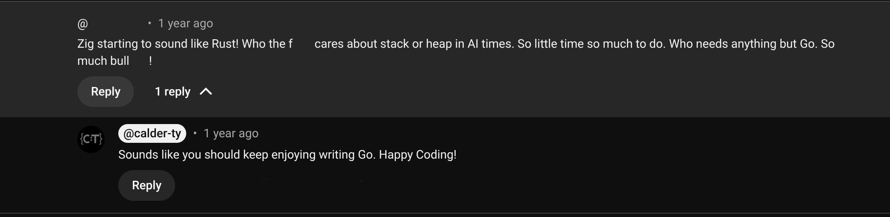

### Who Am I?

- Tyler Calder
    - Software engineer
    - Husband and father
    - I enjoy hiking, swiming, and reading
    - Owner and administrator of ziggit.dev

::: notes
**Purpose**: Introduce myself, my background, and any credentials that I think are relevant. Build
rapport with the audience

- Ziggit: a community for zig developers of all levels, beginners to experts.
:::

### Ziggit Moderators

- Sze
- Pierrelgol: github.com/pierrelgol/pierrelgol
- Dimdin: github.com/dimdin
- Tensorush: 

::: notes
**Purpose**:  Give a shout out to the mods who make ziggit amazing
- I would be remiss if I didn't mention my amazing team of moderators
- Volunteer to make the comunity better
- You should check out their sites, they are all accomplished developers in their own right.
:::

### Eastern Airlines Flight 401

::: notes
**Purpose**: Provide an analogy to why it is important to be aware of where our focus is, and keep
our focus on the important things

Eastern Airlines Flight 401, Accident occured December 29th 1972

- Flight from JFK airport to Miami 
- 11:30 PM, Nose Landing Gear light was not on, which would indicate that the NLG was "Down and Locked".
- Flight was put in a holding pattern over the everglades while crew diagnosed the issue.
- While diagnosing the issue, crew failed to hear an indicator tone telling them that the flight had
  deviated from it's altitude by +250 feet.
- Once crew returned to flight, it was too late, the plane crashed and killed over 100 individuals
  on board.
:::

### Lessons Learned from Flight 401:
::: incremental
- Primary cause of the crash was that the entire crew was distracted.
- Warnings were not "obvious" nor "attention getting"
:::

::: notes
**Purpose**: Highlight that 'crew innattention' was the problem, and that the crash led to a change
in the industry.

- Point of story is not about bad software causing an accident, because that isn't what happened.

> The NTSB cited the primary cause of this accident as flight crew inattention. All three crewmembers and an additional passenger on the flight deck were completely focused on a gear-position-indicating problem to the total exclusion of the operation of the airplane

- The crash and subsequent investigation brought major changes in Airline Industry
:::

### So what?

::: incremental

- What is the purpose of software?
- How do we evaluate software?

:::

::: notes
**Purpose**: Establish my thesis about Developer Experience being symptomatic of distractions in
software development.

It is my belief that a developer experience can be a distraction, one that can blind us to real
problems in software design. If we do not, as developers get a hold of it, it could send our
projects crashing into mediocrity.
:::

### What is the purpose of software?

:::notes
To reason about these claims, it is imperative that we Identify what value of software is.
Without hammering that out, we have no leg to stand on.
:::

### 
> The purpose of a programming system is to make a computer easy to use.
>
> -- Fredick P. Brooks

::: notes
**Purpose**: Introduce the purpose of software, and argue that this is foundational to our role as
software developers.

The late Fred Brooks stated this beautiful summation of the purpose of any software (or
programming as he called it) system.

I would add that the when we say "Make the computer easy to use", implies that there is a 
User and that user is the prime person for which software is made.

- Computers are incredible machines, capable of performing real work types of work that are just not
  possible for other machines or in ways that other machines cannot do.
- They are, however, very complicated. 
- One of the joys of programming is that we get to have these powerful machines at our behest.
- Yet these machines are needed by billions of non-technical people every day.
- Thus our purpose as Software Developers is to help unlock these incredibly powerful and incredibly
  useful machines for those who cannot do it.
- Every software developer holds a stewardship to the owners of the machines that run their
  software.
:::

### What is Developer experience
::: incremental
- The experience a software developer has in creating software
- Good DX removes Friction
- Bad DX inhibits development
:::

::: notes
**Purpose**: Define DX.

- The experience a software developer has in creating software
- Good DX is associated with removing friction in the process of development
- Bad DX is associated with processes, techniques, technologies or language features that inhibit a
  software developer from writing software
:::

### 

> Developer experience, also known as DX or DevEx, is just as essential as user experience for
> organizations looking to drive innovation and stay ahead of the competition.
>
> -- gitlab.com "What Is developer Experience"

:::notes
**Purpose**: Introduce the claims, and justifications for DX that are suspect

- DX is just as essential as User Experience?!
- Good DX is claimed to build better software? How?
- DX is often used as a metric of evaluating code and software packages for use and quality
:::

### A disconnect

Insert diagram of disconnect

::: notes
There is a discconnect in the way we evealuate software, and the way we evaluate code that makes
software. Developer experience is lauded as just as important as UX. It drives how we evaluate
libraries and packages for incorporation into our projects.

Where did this disconnect come from?
:::

### Learned Ignorance

::: notes

- Software can be thought of delivering two values:
    - Behavior, i.e. what the software actually does for a user/accomplishes
    - Architecture, i.e. the ability of software to change to new requirements

- Bob Martin argues that the second is the most important aspect of software.
    He has a thought experiment about what is preferable "Software that works but can't be changed"
    or "Software that doesn't work, but can be changed". He argues that the second is more valuable
    because you can change the software that is broken to be fixed, but once requirements change
    the first software is useless. 

    It's a clever argument, but it is only successful in showing that being easy to modify helps
    software to keep its primary value, which is the ability to produce good behavior. Indeed if you
    had software that could _never_ be correct, it would be completely useless. The ability to
    change software is only valuable because there is an underlying value that those changes
    progress towards.
:::

### Why does this matter?

- Our Values determine what choices we make, and how we evaluate trade-offs.
- When we have multiple values, often they can come into conflict. What we need is
an adjudicating 

::: notes
What we value determines what choices we make and how we evaluate trade-offs. 
Unfortunately The argument that Bob Martin makes around the Values of Software introduces a wedge
into how we build software.

The behavior value of software primarily benefits it's user. The Architectural Value of software
benefits it's owner. Now Ideally these two values would not be in complete conflict. Often what can
make good behavior also makes software dyanmic. If I had to buy new software everytime I got a new

mouse or keyboard, that would be bad. However the wedge exists, and it is, in my opinion,
exacerbated by the modern practice of Subscription Software. Here, user and owner are now split, and
what benefits the user does not have to benefit the owner and vice-versa.
 
I'm not being unfair here, in his book Clean Architecture, where he goes over these principles, Bob
Martin says his goal is to help "software developers to build systems that will have long and
profitable lifetimes".

Notice how the purpose here has shifted from systems that make a computer easier to use, to one that
is self-referential. The purpose of software is to perpetuate itself. While having software with a
long lifetime isn't a bad goal, it cannot be _the_ goal. While having software that makes a profit
is not a bad goal, it can not be _the_ goal. Software should not be the proverbial self-licking ice
cream cone.

Unfortunately the Industry has, for the most part, decided that Bob Martin is right, and that what
matters most is the future value of software, often to the detriment of current Users.
:::

### Enter Developer Experience

::: incremental
- When we work in software, it is hard to _not_ see ourselves as users of software.
- When the time comes to evaluate software, we see ourselves as a user.
    - Ergonomics
    - Ease of Use
- However that 
:::

::: notes
**Purpose**: Note how Developers see their experience as user experience and begin puting themselves
in the position of user.

Software Developers work in a unique craft. In software, our tools, our medium and our product are
all software. When we look at code and software, we often evaluate it from how easy or ergonomic it
is for us to use. This is an understandable error to make. But it is an error. The goal of software
development is not _our_ comfort, but the ease of our users, and ultimately, the owner of the
machine.

Software has some inherent complexity. The key is deciding when, how and where that complexity is
eaten. There is a strange and odd tug of war between the library developer and application
developer. Who owns and eats the complexity for the user? I'm not sure i have a good answer for
that, but we need to be aware of it when developing our software.
:::

### How we evaluate code

::: incremental
- What makes good Software?
    - Correct
    - Simple
    - Portable
    - Efficient
    - Extensible

- What makes good code?
    - Correct
    - Ergonomic
    - Conventional
:::

::: notes
- Evaluating code is pretty difficult
- Software _is_ code, yet the relationship between how we evaluate software and code don't align
- Evaluating code _should_ be reflective of how we evaluate software
    - But Often there is a discontinuity.
- I believe this misalignment comes from the fact that measuring code at a granular level is
  difficult to accomplish, and we want and need to be able to evaluate the code.
:::

### Case Study: Zig Interfaces
::: incremental
- Strategic Friction
:::

::: notes
A common idea around Developer Experience is that it removes friction so that the developer can
focus on producing software.

Having helped administer and moderate a community for Zig developers, particularly new ones, I've
had a fun perspective into peoples introduction to the language. One of the most frequent requests
I've seen from new users, particularly those from higher level languages, is for Zig to add syntax
for Interfaces. The arguments are frequently around ergonomics. And I don't blame these developers,
often they don't have knowledge of the possible downsides to using interfaces throughout their code.
If they've read the latest and greatest software design books they would see interfaces as an
unambiguous good.

However interfaces are not free. The choice by Andrew and the core team to not support syntax for
interfaces is one of _strategic_ friction. The idea is that some things _should_ be hard to do, to
dissuade people from always reaching for it. Particularly when a language, like zig, has many other
means of achieving polymorphism, that might be better for the usecase, but are less likely to be
known.
:::

### How should we look at software and code

### Tools vs Medium vs Product

- Keep track of what is a tool and what is our final product

::: notes
As stated earlier, software developers have a unique craft, where our product, our tools and our
medium are often all the same _thing_, software. It is imperative then that we are vigilant about
what we use as a tool to make software development easier isn't accidentally integrated into our
product.

As an example, an artist uses many kinds of paint, brushes, and other tools to develop his art,
but those tools are not displayed next to or as part of the painting. The Sistine Chapel ceiling would be
much harder to appreciate if we still had to climb around the scaffolding used during it's
painting.
:::

### Code is Executed > Read > Written

::: notes
The refrain that code is read more than it is written is common. It reminds us that when we write
code we should not optimize in ways that make code easy to write, but easier to read. I think this
is a valuable thing to understand. However if that is true, it is also true that any successful 
softwares code is Executed far more often than it is read. Yet often the performance and efficency
of software is often relegated as a secondary concern.

    Tangent about Readability.

    Readability is an aspect of Developer Experience that I have a soap box to get on. Readability
    is proportional to ones familiarity with the codebase, language or system. 90% of the time
    someone says that code is "Unreadable", what they are really saying is "I'm a novice in system I
    am evaluating".

    So the question really is how quickly can a novice grasp what is going on in the code. Things
    that improve that are: Does the code follow consistent conventional patterns? Do the names used
    in the code provide correct semantics? Does it use obscure patterns? Are they documented?
:::

### Understand the Machine

::: incremental
- Software is a set of instructions that can alter the behavior of a programmable machine
- The machine is just as integral to software as is the code
:::
::: notes
- Here is a comment on a video I made about stacks and heaps and zig. (Comment has been deleted to
  protect this user, I don't want people going and flaming him.) There is a tendency with developer
  experience/abstractions/easy way to do things to ignore what is really going on. Even more present
  in the day of AI coding, it is easier and easier to get away with not understanding what is going
  on with software.
- The essence of software is that it is a set of instructions given to alter the behavior of a
  programmable machine.
- Often things that provide ergonomics and developer expereince abstract away the machine, to make
  it simpler to use. Abstractions do not absove us of the responsibilty of understanding our
  machine. There are many who would argue that we should rely on experts who have already trod that
  ground. This is a mistake.
- I don't care if the machine is your x86 CPU, a CNC machine, or the Python Interpreter. You should
  be invested in learning how it works so that your code can interface with it the best it can.
:::

### Together We serve the User
::: notes
Ultimately if we are interested in writing Software that can be loved, then we need to understand
what love is. That which we love is that which we give our attention to. For software to be loved,
it must be crafted by those who give sincere attention to it, and the Users who will use it.

Remember, together we serve the user.
:::

###

Tyler Calder:

    - www.calder-ty.com
    - Calder-Ty on Ziggit
    - calder-ty@protonmail.com

### References:

- https://www.faa.gov/lessons_learned/transport_airplane/accidents/N310EA
- https://about.gitlab.com/topics/devops/what-is-developer-experience
- _The Mythical Man-Month_ Fredrick P. Brooks
- _Clean Architecture_ Robert C. Martin
- _How Rust Views Tradeoffs_ Steven Kablink
